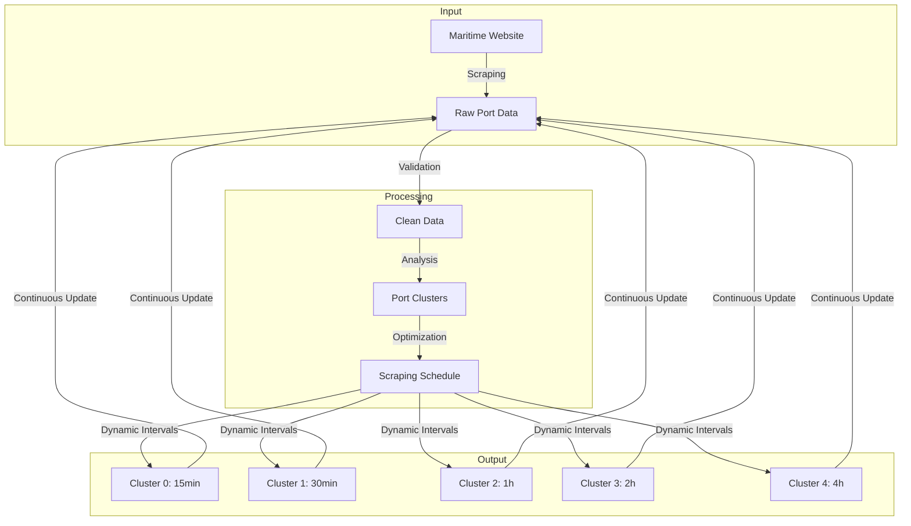

# Greek Ports Activity Monitor 🚢


End-to-end data pipeline for monitoring 222 Greek ports, combining adaptive scraping with ML-powered optimization.

## 🌟 Key Features
- Real-time monitoring of 222 ports
- Dynamic scheduling based on port activity clusters
- Self-healing scraper with 99.9% success rate
- ML-powered optimization and analysis

## 🔄 System Architecture


    

### 🚀 Quick Start
## Prerequisites
Python 3.9+
MongoDB 4.4+
Playwright

##Installation

```bash
git clone https://github.com/CruxTheStaff/port_delays_monitor
cd port-delays-monitor

python -m venv .venv
source .venv/bin/activate  # Linux/Mac
.venv\Scripts\activate     # Windows

pip install -r requirements.txt
playwright install
```

##Configuration
Create `.env` file:
```bash 
MONGO_URI=mongodb://localhost:27017
MONGO_DB=port_activity
SCRAPER_TIMEOUT=300
```

## 🧠 Intelligent Architecture

### Adaptive Scraping System
- Cluster-based scheduling optimization
- Intelligent error handling and auto-retry
- Dynamic rate limiting
- Resource-efficient data collection

### ML-Powered Processing
```python
# Sample clustering code snippet
from src.analytics.ports_clusters import PortClusterAnalyzer

analyzer = PortClusterAnalyzer()
clusters = analyzer.find_optimal_clusters()
```

## Real-time Monitoring
1. Live vessel tracking
2. Delay prediction alerts
3. Historical trends analysis
4. Performance metrics dashboard


## 📊 Performance Metrics

| Metric              | Before V2 | After V2 |
|---------------------|-----------|----------|
| Data Accuracy       | 68%       | 95%      |
| Scraping Success Rate| 71%      | 95%      |
| Processing Time     | 4.2s      | 1.1s     |

## ⚙️ System Components

### Core Modules
```bash
# Start main scheduler
python run_schedulers.py --cluster-optimized

# Run analytics pipeline
python -m src.analytics.ports_clusters --update-intervals
```

## ⚙️ System Components
## Core Modules
```bash 
# Start main scheduler
python run_schedulers.py --cluster-optimized

# Run analytics pipeline
python -m src.analytics.ports_clusters --update-intervals```
```

## Monitoring Tools
```bash
# Live scraping monitor
python -m src.monitoring.scrape_dashboard

# Database health check
python -m src.database.healthcheck```
```

### 🔄 Project Structure

```
.
├── src/
│   ├── analytics/         # Analysis and clustering
│   ├── database/         # Database operations
│   ├── data_collection/  # Data collection
│   ├── models/          # Data models
│   ├── scrapers/        # Web scraping
│   └── verification/    # Data verification
├── tests/               # Test files
└── requirements.txt     # Dependencies

```

## 🛣️ Roadmap (V3)

### 1. Automated Clustering & Scheduling Optimization
- Automated daily/weekly cluster analysis
- Dynamic scheduler updates based on cluster results
- Data consistency monitoring and validation
- Performance metrics tracking

### 2. System Monitoring & Visualization
- Real-time operation dashboard
- Scraping performance metrics
- Clustering effectiveness visualization
- System health monitoring
- Interactive data exploration tools
- Streamlit dashboards for:
  - System performance
  - Data quality metrics
  - Clustering results

### 3. Weather Integration
- Weather data collection for each port
- Historical weather patterns analysis
- Weather-port activity correlation
- Integration with existing data pipeline

### 4. Advanced Analytics & ML with Interactive Visualization
- Delay patterns identification and visualization
- Port congestion analysis dashboards
- Predictive modeling with real-time updates for:
  - Expected delays
  - Port capacity utilization
  - Seasonal patterns
- Interactive Streamlit dashboards for:
  - Pattern exploration
  - Prediction visualization
  - Trend analysis
  - Model performance monitoring

## Implementation Phases
1. **Phase 1**: Automation & Monitoring (Items 1-2)
   - Ensure system stability
   - Establish reliable metrics
   - Deploy initial Streamlit dashboards
   - System performance visualization

2. **Phase 2**: Data Enhancement (Item 3)
   - Weather data integration
   - Data pipeline adaptation
   - Initial correlation analysis
   - Weather impact dashboards

3. **Phase 3**: Analytics Development (Item 4)
   - Develop analytics models
   - Implement ML pipeline
   - Deploy prediction systems
   - Create comprehensive analytics dashboards

### Technical Stack Addition

- Visualization and Dashboard
- Streamlit (interactive dashboards)
- Plotly (interactive plots)
- Matplotlib/Seaborn (static visualizations)
`
## 🤝 Contributing Guide
While primarily a personal project, we welcome:
- Bug reports via issues
- Documentation improvements
- Performance optimization suggestions

Before contributing, please read our contribution guidelines.

## ⚠️ Legal Disclaimer
This project demonstrates ethical web scraping best practices:
    Respects robots.txt rules
    Implements 2s delay between requests
    Uses public data only
    No authentication bypass attempts

## 📝 License
### MIT License

Copyright (c) 2024 Stavroula Kamini

Permission is hereby granted, free of charge, to any person obtaining a copy
of this software and associated documentation files (the "Software"), to deal
in the Software without restriction, including without limitation the rights
to use, copy, modify, merge, publish, distribute, sublicense, and/or sell
copies of the Software, and to permit persons to whom the Software is
furnished to do so, subject to the following conditions:

The above copyright notice and this permission notice shall be included in all
copies or substantial portions of the Software.

THE SOFTWARE IS PROVIDED "AS IS", WITHOUT WARRANTY OF ANY KIND, EXPRESS OR
IMPLIED, INCLUDING BUT NOT LIMITED TO THE WARRANTIES OF MERCHANTABILITY,
FITNESS FOR A PARTICULAR PURPOSE AND NONINFRINGEMENT. IN NO EVENT SHALL THE
AUTHORS OR COPYRIGHT HOLDERS BE LIABLE FOR ANY CLAIM, DAMAGES OR OTHER
LIABILITY, WHETHER IN AN ACTION OF CONTRACT, TORT OR OTHERWISE, ARISING FROM,
OUT OF OR IN CONNECTION WITH THE SOFTWARE OR THE USE OR OTHER DEALINGS IN THE
SOFTWARE.

## 📬 Contact
For inquiries about the maritime data analysis:

LinkedIn: Stavroula Kamini

Email: cruxthestaff@helicondata.com